# Halloween Memory Game

## Description

Introducing Halloween Memory Game, a Halloween-themed card-flip game inspired by the classic Concentration game. The goal of the game is to find matching pairs of cards. With each card flip you'll be sure to find some spooky yet adorable surprises. 
The game offers 3 difficulty levels to cater for players of all ages & skill levels.
 
Challenge your memory skills & attempt to match all cards in as little moves as possible!
 
[Link to the deployed website](https://akirby23.github.io/halloween-memory-game/)

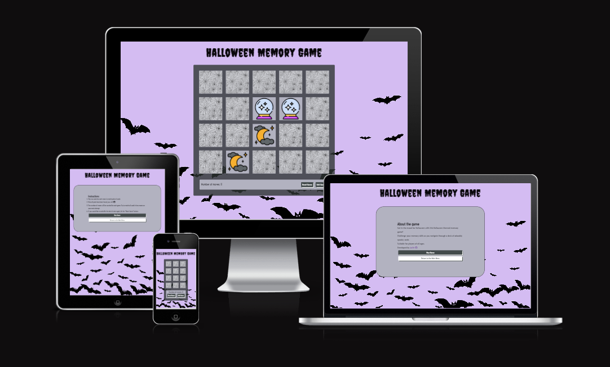

## User Experience

### Features

#### Existing Features

##### Header

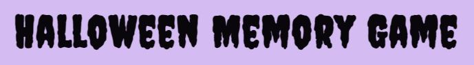

The header contains the title of the game in a delightfully creepy "Creepster" font.

##### Main Menu

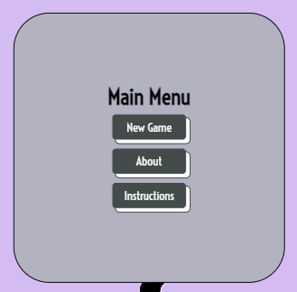

The main menu contains the following buttons that allow the user to navigate between the main menu, about & instructions sections and the game itself:

###### New Game button

- The New Game button will populate the Select Difficulty menu in the form of a modal.
  
###### About button

  - The About button on the main menu populates a modal that gives the user a brief description of the game.
  - This section also contains a link to the GitHub page of the developer.
  - The user can either start a new game or return to the main menu from the about section.

###### Instructions button

  - The Instructions button on the main menu populates a modal that contains an ordered list of the game's instruction.
  - The user can either start a new game or return to the main menu from the instructions section.

##### Select Difficulty menu

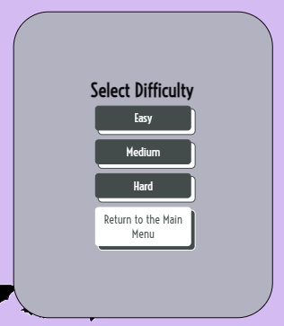

The Select Difficulty menu populates when the user starts a new game from the main menu.
 
The user can either choose to play the game on Easy, Medium or Hard mode, or return to the main menu.

- If the user chooses to play the game on Easy mode, the game will run and a board of 12 cards will be generated.
  
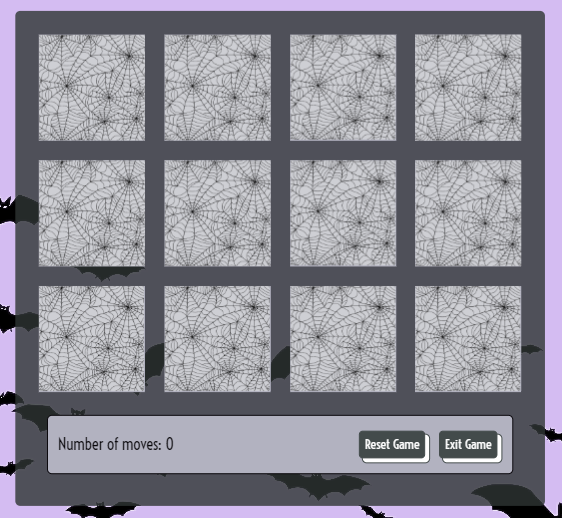

- If the user chooses to play the game on Medium mode, the game will run and a board of 16 cards will be generated.

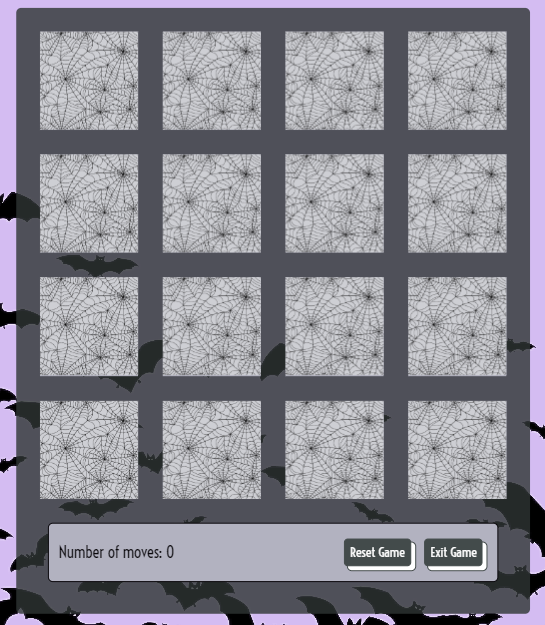

- If the user chooses to play the game on Hard mode, the game will run and a board of 20 cards will be generated.

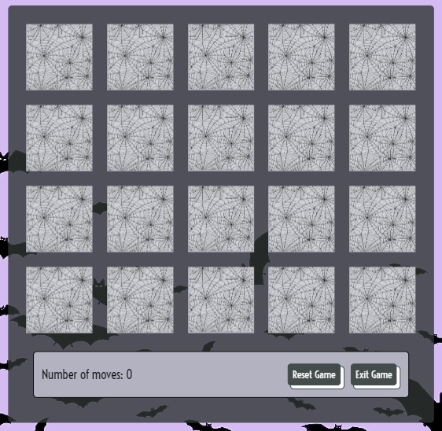
  
##### Game page

###### Game area
  - The game area contains a board of 12, 16 or 20 cards, depending on the difficulty level selected by the user.
  - All cards are facing down by default. When the user clicks on a card, it will flip over to reveal the image on the front. The user will no longer be able to click on the same card - they will need to pick a new card in order to proceed. 
  - If both cards have identical images, the cards will remain flipped up and will no longer be clickable.

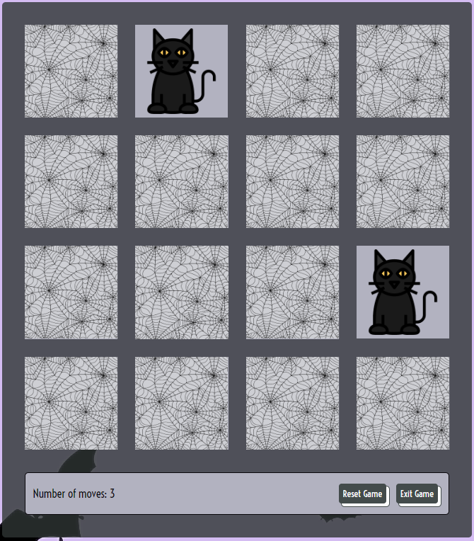

  - If the images on the cards do not match, they will be flipped back down so the user can try again.
  
###### Number of Moves counter

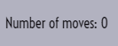

  - The user gets to select 2 cards for each move.
  - Once the user selects 2 cards, the number of moves will increase by 1, regardless of whether or not the cards match.
###### Reset Game button

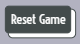
  - This button allows the user to easily start the game again without the need to return to the main menu.
  - Upon clicking the button the user will be prompted to confirm their decision to reset the game via a confirm() alert to ensure that progress is not lost in the event of a misclick.
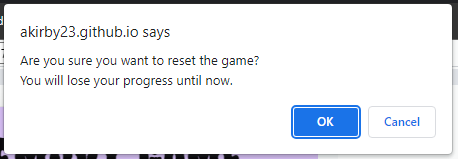
  - If the user confirms their choice the cards will be flipped back down & re-randomized. The number of moves counter will also be reverted back to 0.
  - If the user cancels, they will be able to continue with the game.
  
###### Exit Game button

  - This button allows the user to safely exit the game and return to the main menu.
  - Upon clicking the button the user will be prompted to confirm their decision to exit the game via a confirm() alert to ensure that progress is not lost in the event of a misclick.

  - If the user confirms their decision to exit the game, they will be returned to the main menu. The game will also be reset to ensure that a fresh new game can be started if the user opts to start a new game from the main menu.  
  - If the user cancels, they will be able to continue with the game.

##### Win game window

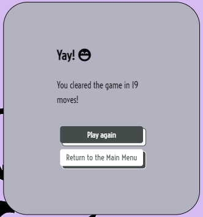

Once all cards have been matched, a modal will appear that will celebrate the user's win.
The user will be informed of how many moves it took them to clear the game.
The user has a choice of two buttons to click once they finish the game:

###### Play again button

  - This button resets the game and returns a fresh deck of cards, matching the same difficulty level that the user initially selected.
  
###### Return to the Main Menu button

  - This button allows the user to safely return back to the main menu.
  - The game will also be reset to ensure that a fresh new game can be started if the user opts to start a new game from the main menu. 
  - The styling for this button has been inverted to differentiate between the buttons that allow the user to proceed with the game or the buttons that will bring them back to the main menu.  
  
#### Future Features

- Introduce varying time limits to each of the difficulty levels to further challenge the user in an exciting way.
- Create a high score counter to add a competive aspect to the game. The fewer moves it takes to clear the game, the higher the score. 
- Add audio to the game, with the option to toggle it on/off, for a more immersive and interactive gameplay experience. 
  - Background music to match the Halloween theme.
  - Card match/card mismatch sound effects.
- Card animation for matched/mismatched cards for enhanced visual effect & interactivity.
   - When cards match, add a blinking animation to both cards.
   - When cards don't match, add a shaking effect before the cards flip back down. 
- Replace confirm() alerts with modals to improve the UI & accessibility.
  
### Design

#### Colour Scheme

- #09070B was used for the text & button styling.
- #2E3433 was used to style the buttons.
- rgba(46, 52, 51, 0.8) was used as a transparent background behind the game area, in order to for the background image to remain visible while not distracting from the elements within the game area.
- #434B4B was used as a background colour for the modals & game cards.
- #D4BCF2 was used as the background colour & also matches the background image.
- #FFFFFF was used to add contrast to the buttons.

The black & grey colours were generated from the halloween-castle icon via [ImageColorPicker](https://imagecolorpicker.com) for consistency & to match the Halloween theme.
A lilac colour was chosen as the background colour to add a dash of cuteness to the spooky theme, making it more playful & approachable.

#### Typography

- "Creepster" with a fallback font of "cursive" was used for the main heading to match the Halloween theme of the game.
- To compliment the heading font & the game's theme, "Voltaire" with a fallback font of "sans-serif" was used for the rest of the text in the game.
- Both fonts were imported from Google Fonts.

## Technologies Used

### Languages

- HTML was used to write text content for the game.
- CSS was used to style the game.
- JavaScript was used to create the interactive elements of the game.

### Frameworks, Libraries & Programs Used

- [CodeAnywhere](https://app.codeanywhere.com/): to write the code.
- [Git](https://git-scm.com/): for version control, to commit & push the code to GitHub.
- [GitHub](https://github.com/): to store the code in its repository.
- [GitHub Pages](https://pages.github.com/): to deploy the website.
- [Chrome DevTools](https://developer.chrome.com/docs/devtools/): for debugging and for testing for responsiveness on various screen sizes.
- [Google Fonts](https://fonts.google.com/): to import the "Creepster" and "Voltaire" fonts for the website.
- [Font Awesome](https://fontawesome.com/): to import icons to style the modals.
- [Flaticon](https://www.flaticon.com/): to obtain the images for the front of the cards.
- [Shutterstock](https://www.shutterstock.com/): to obtain the background image & to change the background colour of the image.
- [Favicon](https://favicon.io/): to generate the favicon & to obtain links to add the favicon to the website.
- [AmIResponsive](https://ui.dev/amiresponsive): to test the website's responsiveness on screens of different sizes.
- [ImageColorPicker](https://imagecolorpicker.com/): to generate the colour palette from the halloween-castle icon.
- [Coolors.co](https://coolors.co/241e20-8c6a4f-ffffff-3c5648-76a38f): to generate the colour palette for the README file.
  
## Testing

### Validator Testing

HTML

The HTML was validated via the [W3C Markup Validation Service](https://validator.w3.org/).

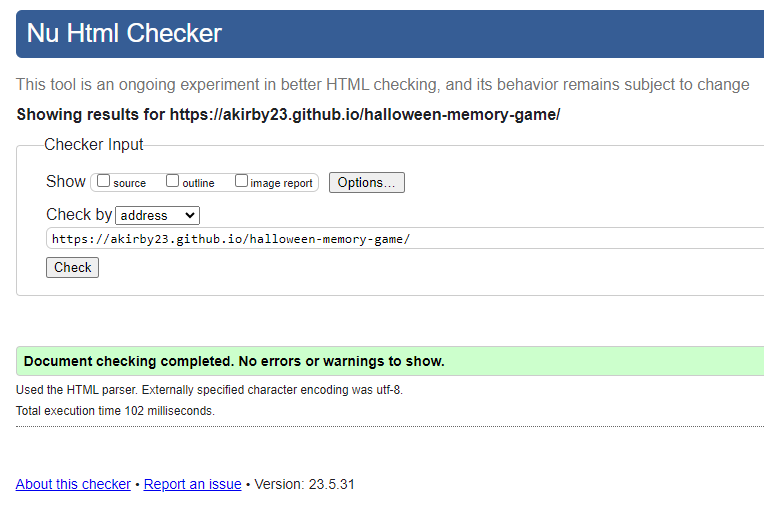

It passed without warnings or errors.

CSS

The CSS was validated via the [W3C CSS Validation Service](https://jigsaw.w3.org/css-validator/).

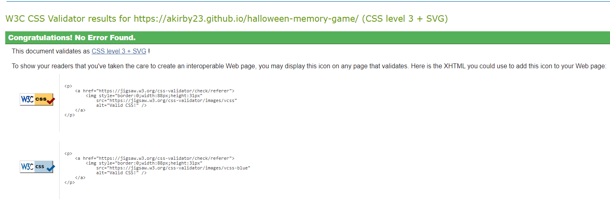

It passed without any issues or warnings. 

JavaScript

The JavaScript was validated via [JSHint](https://jshint.com/).

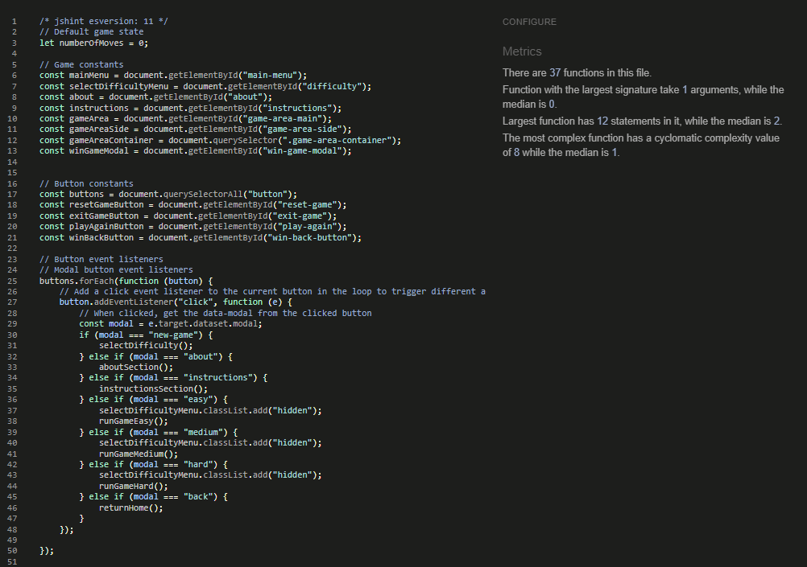

It passed without any warnings. 

### Accessibility Testing

Lighthouse audits were run for the website on mobile & desktop to test for any accessibility issues. 

Mobile

A perfect score was achieved for Accessibility, Best Practices & SEO. 

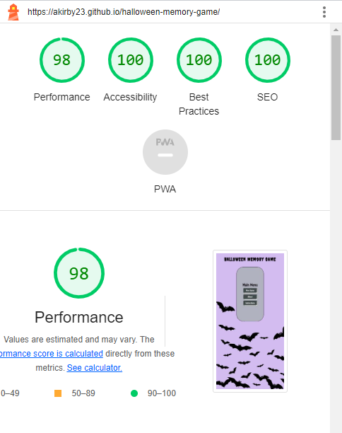

Performance suffered slightly due to cache issues. 

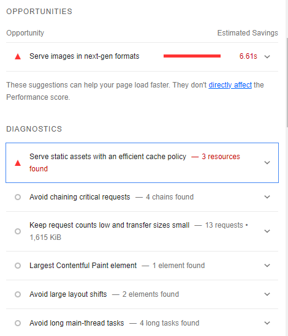

Desktop

A perfect score was achieved for Performance, Accessibility, Best Practices & SEO. 

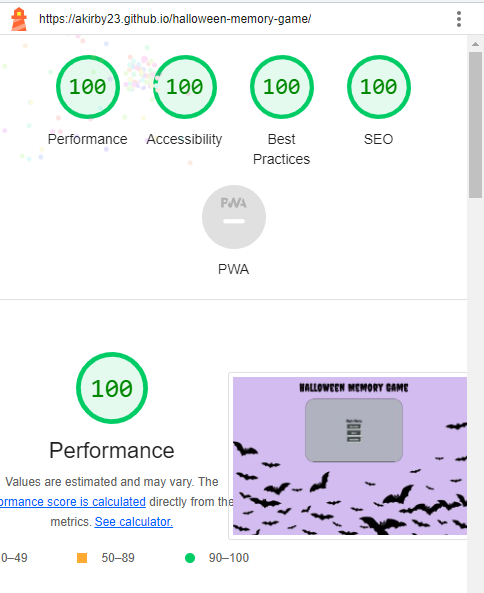

## Deployment

The site was deployed to GitHub pages. The steps to deploy are as follows:

- In the GitHub repository, navigate to the Settings tab.
- On the left hand side of the page, navigate to Pages.
- From the source section drop-down menu, select the Main Branch
- Once the main branch has been selected & saved, the page will be automatically refreshed with a detailed ribbon display to indicate the successful deployment.

## Credits

### Code

- [w3schools](https://www.w3schools.com/) was consulted regularly for help with writing the HTML, CSS & Javascript.
- [Stack Overflow](stackoverflow) was consulted regularly for help with writing HTML, CSS & JavaScript and troubleshooting issues.
- Inspiration was taken from [developedbyed](https://www.youtube.com/@developedbyed)'s [Memory Card Game Tutorial](https://www.youtube.com/watch?v=-tlb4tv4mC4&t=2180s) to generate the game's cards using JavaScript.
- Inspiration was taken from the [Love Maths](https://github.com/Code-Institute-Solutions/love-maths-2.0-sourcecode) project to create event listeners for the modal buttons by targeting their data types in if/else statements.

### Media

- Credit to the following artists from [Flaticon](https://www.flaticon.com/) who made the images used for the front of the cards:

  - [iconixar](https://www.flaticon.com/authors/iconixar) who made the halloween-moon & halloween-castle icons.
  - [tulpahn](https://www.flaticon.com/authors/tulpahn) who made the halloween-ballons icon.
  - [mavadee](https://www.flaticon.com/authors/mavadee)  who made the halloween-cat icon.
  - [Freepik](https://www.flaticon.com/authors/freepik) who made the  halloween-skeleton, halloween-bat, halloween-spider, halloween-cauldron & halloween-witch icons.
  - [Umeicon](https://www.flaticon.com/authors/umeicon) who made the halloween-pumpkin icon. This artist also created the pumpkin icon used for the Favicon.
- The background image & card back image were obtained from Shutterstock. 
  
### Acknowledgements

- My mentor Derek McAuley for taking the time to review my code, provide helpful feedback & for being available for any questions that I had. 
- Sean from the tutor support team for helping me troubleshoot an issue with the event listeners for the modal buttons. 
- My friends and family for testing the game to ensure that it's functional. Special thanks to my friend Josip for reviewing my code and helping me to troubleshoot some issues with finishing, resetting & exiting the game. 